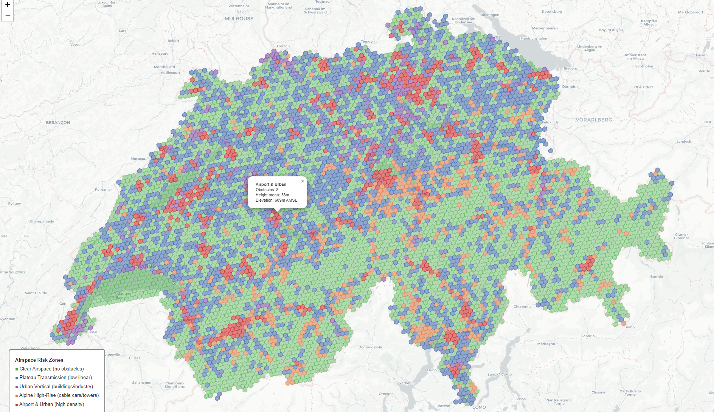
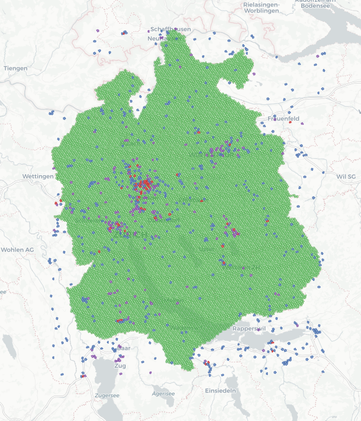

# Swiss Airspace Obstacle Profiling

[](https://www.python.org/)
[](LICENSE)
[](https://opendata.swiss/en/dataset/luftfahrthindernisdaten-schweiz)
[](https://scikit-learn.org/)
[](https://python-visualization.github.io/folium/)
[](https://h3geo.org/)

Spatial clustering of 14,334 registered air navigation obstacles across Switzerland to identify operationally distinct airspace risk zones for low-altitude UAS corridor planning.

<p align="center">
  
  <br>
  <em>Interactive hexagonal risk zone map of Switzerland. Green = clear airspace, Blue = transmission corridors, 
  Orange = alpine infrastructure, Violet = urban/industrial, Red = airport zones.</em>
</p>

## Objective

Segment the Swiss airspace into risk zones based on obstacle characteristics (type, height, density, lighting, terrain elevation) using unsupervised clustering on publicly available data from the Federal Office of Civil Aviation (BAZL). The result is an interactive hexagonal risk map classifying every ~5 km² cell in Switzerland into one of four operational profiles.

## Data Source

| Dataset | Publisher | Format | License |
|:---|:---|:---|:---|
| [Swiss Air Navigation Obstacle Data](https://opendata.swiss/en/dataset/luftfahrthindernisdaten-schweiz) | BAZL | KMZ via STAC API | Open use, attribution required |
| [swissBOUNDARIES3D](https://opendata.swiss/en/dataset/swissboundaries3d-landesgrenzen) | swisstopo | GeoJSON via REST API | Open use, attribution required |

> Attribution: © Bundesamt für Zivilluftfahrt BAZL · © swisstopo · opendata.swiss

## Methodology

**1. Data Ingestion.** Download and parse 14,334 obstacles from the BAZL STAC API (KMZ/KML format) into a GeoDataFrame with 18 attributes including obstacle type, height above ground, elevation, lighting, and airport proximity.

**2. Feature Engineering.** Aggregate point-level obstacles onto an H3 hexagonal grid (resolution 7, ~5 km² per cell), producing 3,976 grid cells with 10 engineered features: obstacle density, height statistics (mean, max, std), terrain elevation, type composition (% linear vs. vertical infrastructure), lighting coverage, type diversity, and airport proximity.

**3. Clustering.** Compare three methods on the standardised feature set: K-Means, HDBSCAN, and DBSCAN. K-Means with k=4 was selected based on the highest silhouette score (0.363) and the most operationally interpretable segmentation.

**4. Validation.** PCA (8 components for 95% variance) and t-SNE projections confirm genuine cluster separability. Geographic overlay maps verify spatial coherence. Silhouette analysis documents soft boundaries consistent with gradual geographic transitions.

**5. Profiling.** Assign operational risk labels and produce interactive hexagonal risk maps for Switzerland (resolution 7) and Canton Zürich (resolution 9, ~0.1 km²).

## Results

| Zone | Cells | Share | Avg Obstacles | Avg Height | Elevation | Key Characteristics |
|:---|:---:|:---:|:---:|:---:|:---:|:---|
| Plateau Transmission | 2,539 | 63.9% | 2.4 | 40m | 1,057m | 91% linear infrastructure, low variance |
| Airport & Urban | 551 | 13.9% | 8.1 | 38m | 693m | Highest density, 94% near airfields |
| Alpine High-Rise | 602 | 15.1% | 4.7 | 107m | 1,481m | Extreme heights, cable cars, valley crossings |
| Urban Vertical | 284 | 7.1% | 3.2 | 51m | 651m | 82% buildings/industry, 45% lighted |

## Cantonal Zoom: Zürich

The grid resolution can be adjusted without architectural changes. Below is Canton Zürich at resolution 9 (~0.1 km²), demonstrating the scalability from strategic overview to operational planning granularity.

<p align="center">
  
  <br>
  <em>Canton Zürich at H3 resolution 9. The higher resolution reveals individual obstacle clusters 
  around Zürich Airport (LSZH), urban centres, and transmission line corridors.</em>
</p>

## Interactive Maps

The `reports/figures/` directory contains interactive HTML maps (download and open in any browser):

| Map | Description |
|:---|:---|
| **risk_zone_map.html** | Full Switzerland with hexagonal risk zones and clear airspace overlay |
| **zurich_zoom_map.html** | Canton Zürich at resolution 9 demonstrating scalability |
| **cluster_map.html** | Cluster assignments with popup details per cell |

## Project Structure

```
swiss-airspace-obstacle-profiling/
├── README.md
├── requirements.txt
├── .gitignore
├── src/
│   └── data/
│       └── fetch_obstacles.py          # STAC API download & KMZ parsing
├── notebooks/
│   ├── data_ingestion_and_quality_assessment.ipynb  # Quality assessment & cleaning
│   ├── feature_engineering.ipynb                    # H3 grid aggregation & features
│   ├── cluster_evaluation.ipynb                     # K-Means, HDBSCAN, DBSCAN comparison
│   ├── dim_reduction_and_visualization.ipynb        # PCA, t-SNE, geographic overlays
│   └── corridor_profiling.ipynb                     # Risk zones, cantonal zoom, final maps
├── data/
│   ├── raw/                            # Original downloads (.gitignored)
│   └── processed/                      # Parquet files (.gitignored)
└── reports/
    └── figures/                        # Interactive HTML maps & plots
```

## Reproducing the Results

```bash
git clone https://github.com/YOUR_USERNAME/swiss-airspace-obstacle-profiling.git
cd swiss-airspace-obstacle-profiling
pip install -r requirements.txt
python src/data/fetch_obstacles.py
```

Then run the notebooks in order (01 → 05). Each notebook reads its input from `data/processed/` and writes its output there. The fetch script must be run once to populate `data/raw/`.

## Tech Stack

[](https://pandas.pydata.org/)
[](https://numpy.org/)
[](https://scikit-learn.org/)
[](https://matplotlib.org/)
[](https://jupyter.org/)

| Category | Libraries |
|:---|:---|
| Data acquisition | requests, fastkml, lxml (KMZ/KML parsing via STAC API) |
| Geospatial | geopandas, h3, pyproj, shapely, folium |
| Analysis | pandas, numpy, scikit-learn, hdbscan, scipy |
| Visualisation | matplotlib, seaborn, folium (interactive maps) |

## Limitations & Future Work

This analysis covers registered air navigation obstacles only. A production-grade UAS flight planning system would additionally require:

- Terrain elevation models (swissALTI3D) for ground clearance calculation
- Land use classification (forests, residential areas) for overflight risk assessment
- Water body data for mission-critical recovery planning
- Restricted airspace zones (SORA categories, TMA, CTR)
- Real-time NOTAMs and temporary flight restrictions
- Dynamic obstacles (construction cranes, temporary structures)

These extensions are planned as separate projects building on the grid infrastructure established here. The H3 resolution parameter can be adjusted from 7 (strategic overview) to 9+ (operational planning) without architectural changes.
